## 1. Proyecto

Prueba local:

```shell
./mvnw clean verify
./mvnw spring-boot:run
curl http://localhost:8080/
curl http://localhost:8080/version
curl http://localhost:8080/nations
curl http://localhost:8080/currencies
curl http://localhost:8080/aviation
```

## 2. Repositorio y primer push

```shell
git add .
git commit -m "Cambios"
git push origin main
```

## 3. SonarCloud

1. Entré a https://sonarcloud.io con la cuenta de GitHub e importé el repositorio.
2. En Administration > Analysis Method, desactivé Automatic Analysis.
3. En Information, copié Project Key y Organization Key.
4. En My Account > Security, generé un token.
5. En GitHub configuré: Secrets and variables > Actions.
   - Secret `SONAR_TOKEN`: el token generado.
   - Variable `SONAR_PROJECT_KEY`: el Project Key.
   - Variable `SONAR_ORGANIZATION`: el Organization Key.

## 4. Docker Hub

1. Creé cuenta en https://hub.docker.com y un repositorio publico llamado `faker`.
2. Creé un Access Token (Account settings > Personal access tokens) con permiso de lectura y escritura.
3. En GitHub, creé los secrets:
   - `DOCKER_USERNAME`: usuario de Docker Hub.
   - `DOCKER_PASSWORD`: el access token.

## 5. Render

1. En https://render.com creé un Web Service con Existing Image.
2. Image path: `docker.io/<DOCKER_USERNAME>/faker:latest`.
3. Plan Free, primera región.
4. En Settings, Health Check Path puse `/`.
5. Creé el servicio. Render definió la variable `PORT` y la aplicacion la lee con `server.port=${PORT:8080}`.
6. En Settings del servicio copié el Deploy Hook URL.
7. En GitHub creé el secret `RENDER_DEPLOY_HOOK_URL` con ese valor.

El primer despliegue requería que la imagen ya exista en Docker Hub, asi que ejecuté el pipeline en `main` antes de crear el servicio.

## 6. Estrategia trunk based con una segunda rama

La rama `feature/cloud-deploy` se configuró en `build.yml` bajo `on.push.branches`. Los pull requests hacia `main` que también disparan el pipeline.

```shell
git checkout -b feature/cloud-deploy
```

Hice un cambio en el README, y luego hice:

```shell
git add .
git commit -m "feature: cambio en la rama de despliegue"
git push -u origin feature/cloud-deploy
```

En GitHub:

1. Abrí Compare & pull request hacia `main`.
2. Esperé que los jobs tests, sonar y build terminen en verde (docker y deploy no corren fuera de `main`).
3. Merge pull request.
4. El push resultante en `main` ejecuta el pipeline completo, incluida la imagen Docker y el despliegue en Render.

## 7. Verificación en la nube

```shell
curl https://faker-latest.onrender.com/
curl https://faker-latest.onrender.com/version
curl https://faker-latest.onrender.com/nations
curl https://faker-latest.onrender.com/currencies
curl https://faker-latest.onrender.com/aviation
```

## 8. Evidencias

## Workflow en verde
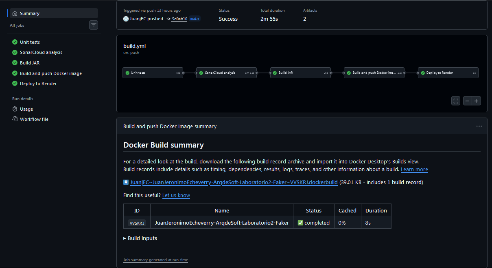

## Sonarcloud
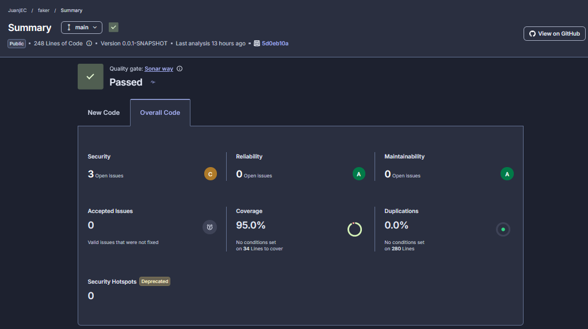

## Docker Hub
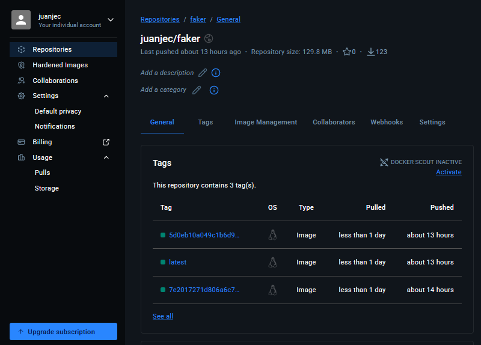

## Render
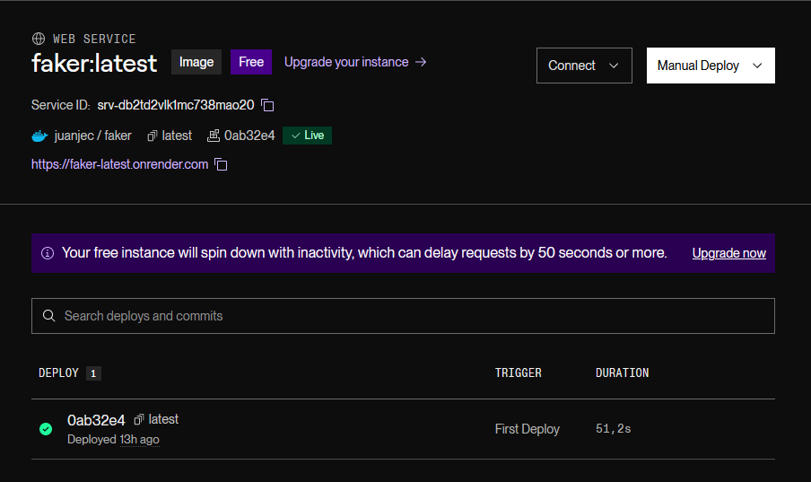
URL del servicio: https://faker-latest.onrender.com

## Endpoints en nube
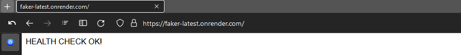

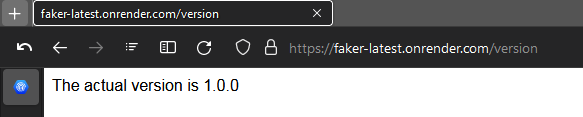

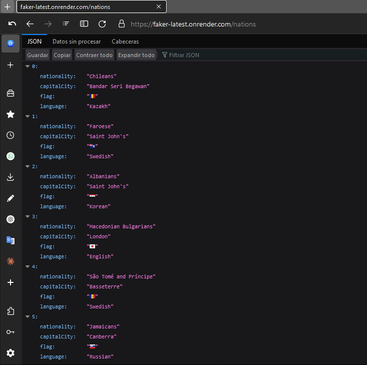

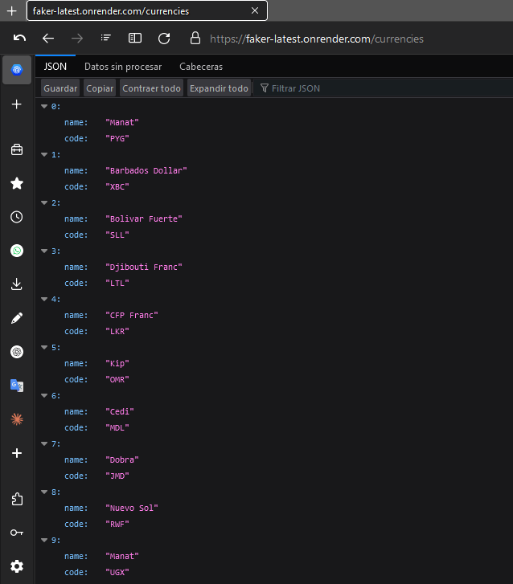

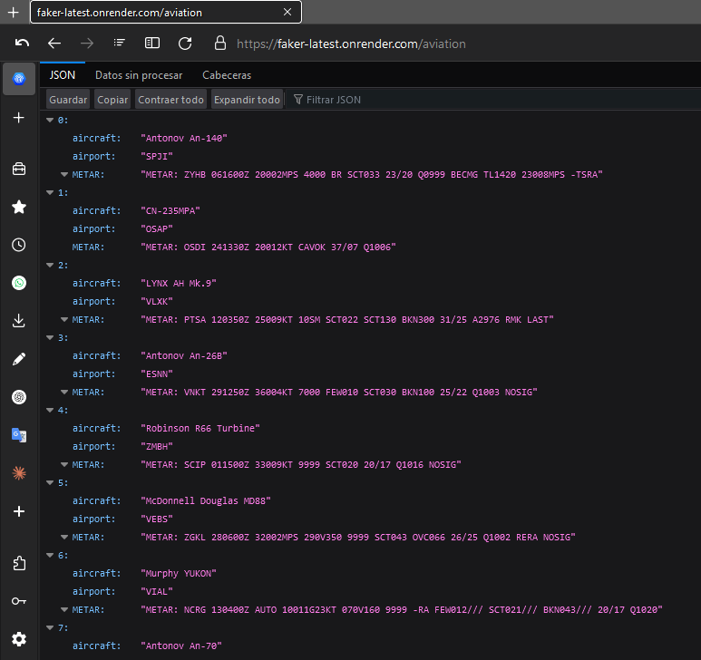

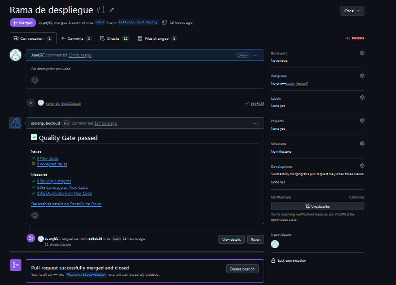

## Grafo
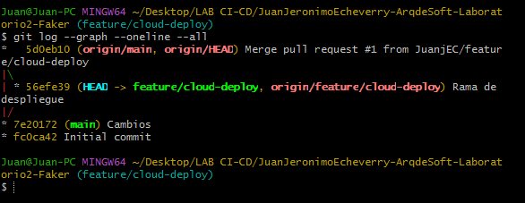

## Snyk
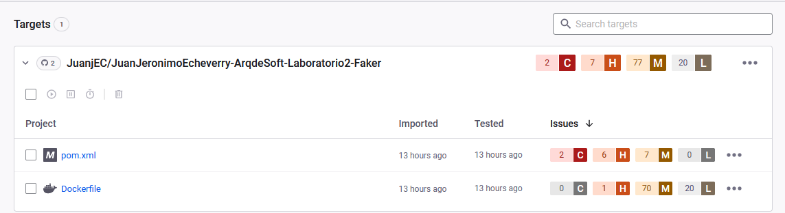